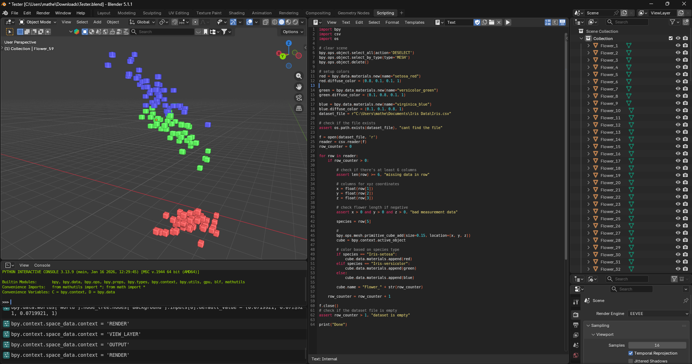

# Iris-3D-Data-Visualizer
**PROJECT DESCRIPTION**

This project provides a Python script for Blender that allows you to visualize the Iris dataset as a neighborhood of cubes in 3D space. Its main use is to simplify the clustered spreadsheet into a more approachable and easy way to spot patterns / clusters.

**--What it does--**

Cleans up the scene

Associates a color for each different Iris species

Maps each numerical value to the 3D space in Blender

**--Prerequisites--**

Download the latest version of blender @ [blender.org](https://www.blender.org/download/)

The Iris dataset @ https://www.kaggle.com/datasets/himanshunakrani/iris-dataset

**--How to use--**

1. Download the script

2. Open Blender

3. Go to the scripting tab

4. Paste the code from visualizer.py

5. Update the dataset_file variable to the location of your Iris.csv file
